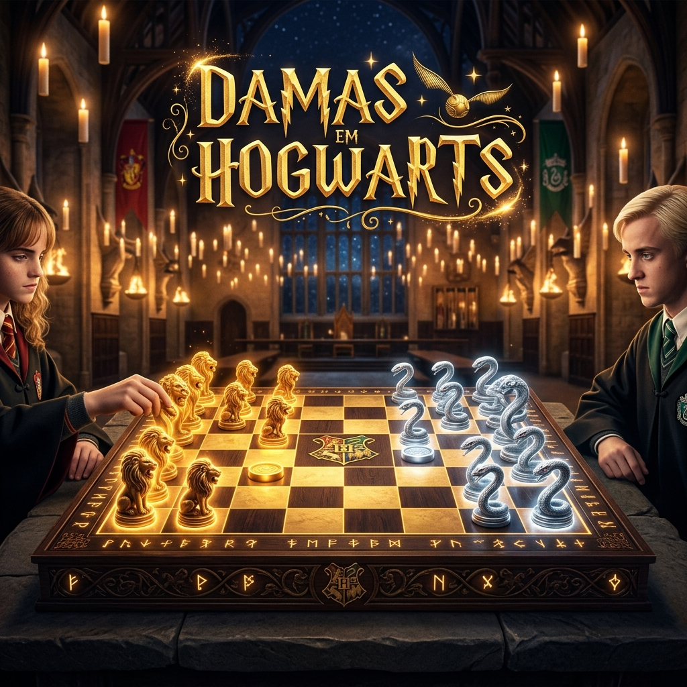

# ⚡ Damas em Hogwarts - O Torneio Mágico de Estratégia



<p align="center">
  
  
  
  
</p>

Bem-vindo ao **Salão Principal**! Este não é um jogo de damas comum. **Damas em Hogwarts** é uma experiência imersiva que transporta o clássico jogo de tabuleiro para o universo de Harry Potter, combinando estratégia profunda com a magia de Hogwarts.

---

## 🔮 O Jogo

Prepare sua varinha (ou mouse) e sua mente. Escolha sua casa, selecione seu oponente e prove que sua estratégia é digna de um Diretor de Hogwarts. Com um design inspirado na estética bruxa, o jogo oferece uma interface premium com efeitos de glassmorphism, animações fluidas e uma atmosfera mágica constante.

### ✨ Funcionalidades Principais

- **🧙‍♂️ Modos de Duelo**:
  - **Duelo contra a I.A.**: Enfrente a inteligência artificial treinada pelo Ministério da Magia.
  - **Duelo Local (PvP)**: Desafie um amigo para um duelo presencial no mesmo dispositivo.
- **🏰 Seleção de Casas**: Represente **Gryffindor, Slytherin, Ravenclaw ou Hufflepuff**. Cada escolha altera a estética visual das suas peças.
- **⚡ O Pombo de Ouro**: Ao atingir a última fileira, sua peça é promovida a **Rei (Dama)** e assume a forma do Pombo de Ouro, ganhando liberdade total de movimento diagonal.
- **🎨 Estética Premium**:
  - Tabuleiro de madeira envelhecida com texturas realistas.
  - Efeitos de brilho (Glow) e partículas mágicas.
  - Tipografia clássica e interface responsiva para todos os dispositivos.

---

## 📜 Regras do Duelo (Regras Brasileiras)

O jogo segue as regras oficiais da **Confederação Brasileira de Damas**, aplicadas com precisão mágica:

1.  **Movimento**: Peças comuns movem-se apenas uma casa para frente nas diagonais.
2.  **Captura**: É possível capturar peças tanto para frente quanto para trás.
3.  **Lei da Maioria**: Se houver mais de um caminho de captura disponível, você é **obrigado** a escolher o caminho que captura o maior número de peças (Regra de Ouro do Duelo).
4.  **O Pomo de Ouro (Dama)**: Possui movimento de longo alcance, podendo saltar várias casas em qualquer direção diagonal.

---

## 🛠️ Forja Tecnológica

Este projeto foi construído utilizando as ferramentas mais modernas do mundo "Muggle":

- **React 19**: Interface reativa e componentes modulares.
- **Vite**: Velocidade de carregamento instantânea.
- **TypeScript**: Segurança de tipos para evitar maldições no código.
- **Vanilla CSS**: Estilização artesanal, sem bibliotecas de utilitários, garantindo total controle visual.

---

## 🚀 Como Iniciar o Torneio

Siga estes passos para rodar o projeto localmente:

1.  **Clone o Repositório**:
    ```bash
    git clone https://github.com/TauaneAlessandra/damas-em-hogwarts.git
    ```
2.  **Entre na Pasta**:
    ```bash
    cd damas-em-hogwarts
    ```
3.  **Instale as Dependências**:
    ```bash
    npm install
    ```
4.  **Inicie a Magia**:
    ```bash
    npm run dev
    ```

---

## 📁 Estrutura de Arquivos

```text
src/
├── components/     # Componentes visuais do jogo e interface
├── hooks/          # Lógica de estado e efeitos mágicos
├── logic/          # Regras oficiais de damas e lógica de IA
├── styles/         # Variáveis CSS e temas das casas
└── types/          # Definições de tipos para TypeScript
```

---

## 🛡️ Créditos

Desenvolvido por **Tauane Alessandra**.

> "São as nossas escolhas que revelam quem realmente somos, muito mais do que as nossas qualidades." — *Alvo Dumbledore*

---
<p align="center">✨ <i>Mala feita, varinha pronta. Que vença o melhor bruxo!</i> ✨</p>
